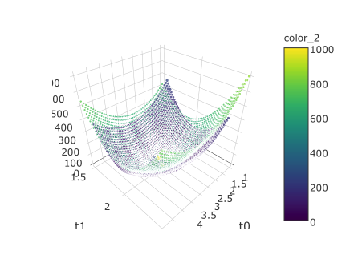

```{r setup, include=FALSE}
knitr::opts_chunk$set(echo = TRUE)
```


#key words
<!-- Hence
Therefore
to sum up
let's put it like this
love the way to put that question
undertake
venture
figure out
in such a fashion
Self organizing
agglomeration
that will hopefully make visual and conceptual sense as well
this shall encourage to
so what just happened
flipped it over
give you a tangible sense
very bizarre
useful concept
you cannot represent this ina a easy grapahble format
position -> point
that's my product right there
let me be very vlear right hear
deeper sense
deeper ways that it can be interpreted
we spoke somewhat theretically
seemingly simple different concepts
can be interpreted in a bunch of different ways
can be shown to represent different ideas ideas or different problems
this hsould start ringing bells in your head
which is another way of saying that
hopefully not being redundant
we've spent a good deal of time on the idea of
let's think about it in terms of
let's see other ways we can interpret this notion
in order to mm be well defined
essentially
satisfy
as well
so on and so forth
->determinant and Rsquared or other measure of linear algebra
->matrix multiplication is the linear combination of column verctors
or the dot product of the row vectors with x
->reduced echelon form of A
-> no free variables -->

# Six Approaches to Linear Regression

This chapter is not an introduction to linear regression, in consequence, we will not delve deeply into its formulation, properties or assumptions. Although undergraduate knowledge of these concepts is suggested, enthusiastic readers should not get discouraged. Hopefully all readers will find this chapter to be a fun journey that relates minimization and maximization problems, linear projections and utility functions in the context of linear regression. Our aim is to better understand the CAPM, the Famma & French Model and the Multi-Factor models, which will be explored in the next chapter.

<!--This chapter is not an introduction to linear regression, instead in this chapter we will learn to relate minimization and maximization problems, linear projections and utility functions in the context of linear regression. The final goal is to better understand the CAPM, the Famma & French Model and the Multi-Factor models. -->

<!--## Linear Regression -->

<!--Since we will not delve deeply into the basic formulation, properties or assumptions of the linear regression, undergraduate knowledge of these concepts is suggested to continue. -->

Let's recall the basic setup for linear regression right off the bat. blabla notacion de Y y X...Linear regression consists of fitting a linear function $\hat y$ given a set of data points $Y$ related to a collection of observations $X$...

##OLS Ordinary Least Squares Approach
In $R^2$ let's think of each data point as a particular instance of an input $x_i$ and an output $y_i$. $\hat{y}(x) = \beta_0 + \beta_1x$ is a line that goes through these data points. <!-- $\hat{y_i} = \hat{y}(x_i) = \beta_0 + \beta_1x_i$ is the predicted value of $y$ provided $x_i$. -->

In order to fit this line we require the squared gap between the points and the line to be small, that is, we want to find the "ordinary least squares" (OLS). In math notation, we want to find which $\hat{y}$ minizes $J_{OLS}(\beta) = \sum_i(y_i-\hat{y}(x_i))^2$. $J_{OLS}(\beta)$ is <!--usually--> called the "ordinary least squares cost or error function\".

To illustrate the OLS we will take a backward apprach. Let's imagine that we have $y$'s that lie exactly over the line $\beta_0^* + \beta_1^*x$. In this case, we are not interested in formulating a model that fits a line for these data points because they lie exactly over one. Instead, what we will do is take a look at its error function $J_{OLS}$. 

<!-- podria incluir ejemplo para y = 2x, J es una parabola -->

$J_{OLS}$ tests different $\beta$'s and provides for each $\beta$ point an aggregated error value. Figure[1] shows the cost function for these data points. As expected, $J_{OLS}$ is a cup that rests on the $z$ plane given that the minimum error value is exactly 0 when $\beta_0=\beta_0^*$ and $\beta_1=\beta_1^*$. 

 

Let's move the $y$'s away from $\beta_0^*+\beta_1^* x$ by adding gaussian errors and let's look at the error function now. Figure [2] constains a plot that compares the previous cost function with the new one. We can see that the new cost function does not rest over the $z$ plane.

 

To find the point in red, which is the minimum value of the new $J_{OLS}$, we need to solve the least squares unconstrained optimization problem:
\begin{equation}
  \min_\beta J_{OLS}(\beta)= (Y-X\beta)^T(Y-X\beta)
\end{equation}
By differenciating $J_{OLS}$ and equating to zero we find the OLS estimate of $\beta$:
\begin{equation}
  \hat \beta_{OLS} = \arg\!\min_\beta J_{OLS}(\beta) = (X^TX)^{-1}X^TY
\end{equation}

The minimum error value of the new $J_{OLS}$ is found at $\beta=\hat \beta_{OLS}$.

<!-- The minimum error value of the new $J$ is [36.4] when $\beta_0$ is [2.9] and $\beta_1$ is [1.9]. That is, the least squares estimate $\hat \beta$ is (2.9,1.9). -->

<!-- Let's say that $3 + 2 x$ is the \"true model\" and that $\beta=(3,2)$ is the \"true $\beta$\". In real world problems our observations are close to the true model, but not over it. Thus, we want to estimate the true $\beta$ and our estimation will be close but never be equal to it. In the next sections, a deeper discussion on the concept of true model is delivered. Thus $\\hat \\beta$ is close to the "true" $\\beta$ but is never exactly equal to it. -->

<!-- This example ilustrates that provided a true model if we collect different samples of data,  each sample will have a different cost function, each cost function will have a different minimum value $\hat \beta$ and each minimum value $\hat \beta$ will be close but never equal to to the true $\beta$.-->

In linear regression problems observations are close to a line, but not over it. Thus, if we collect different samples of data,  each sample will have a different cost function, each cost function will have a different minimum value.<!-- and each minimum value will be as close as possible to zero but will never be equal to it.-->

An interesting fact is that $J_{OLS}$'s cup shifts down and becomes steeper if we have a lot of observations. On the other hand, $J_{OLS}$ shifts up and flattens if we have few observations. Thus, if we search for the minimum of $J_{OLS}$ with Gradient Descent, the algorithm will slide down over $J_{OLS}$'s surface to the minimum quickly if we have big samples. With small samples, the algorithm will move slowly over the cup and will find it difficult to discover its minimum value.   

##MLE Maximum Likelihood Estimator Approach
  
<!-- Let's forget about regression for some time. We will focus on likelihood in the following paragraphs. -->

The key principle of maximum likelihood is that we believe there is a "true model" that governs our data. Provided a true model and a sample output of this model, a likelihood function measures how \"likely\" this output is.

Let's imagine there is a machine that generates numbers. This machine requires an input $x_i$ to generate a $y_i$. The machine uses an unknown rule to generate $y_i$'s. This rule is called the true model. We believe that the true model that governs the machine is a gaussian that looks like this: 

<!-- Let's imagine there is a machine that generates numbers. This machine requires an input $x_i$ and follows some unknown rule to generate a $y_i$. This rule is called the true model. We know that the true model is a linear function of the form $y=\beta_0 + \beta_1 x$. Our task is to is to find $\beta_0$ and $\beta_1$. figure out this rule. 

The task would be quite easy except for one problem, the machine got broken and the $y$'s are generated with errors. Let's assume the errors follow a gaussian distribution. This information translated into math notation looks like this: 

The task would be quite easy except for one problem, the machine got broken and the $y$'s are generated with gaussian errors. This information translated into math notation looks like this:-->

<!--The key principle of maximum likelihood is that we believe that there is a distribution that governs our data. For instance, let's assume the machine's output errors follow a gaussian distribution. This information translated into math notation looks like this:-->

\begin{equation}
    y_i \sim \mathcal{N}(\beta_0 + x_i \beta_1, \sigma^2) = \beta_0 + x_i \beta_1 + \sigma^2 \mathcal{N}(0,1)
\end{equation}

Which can be rewritten as:
\begin{equation}
    e_i = \frac{y_i - \beta_0 - x_i \beta_1}{\sigma^2} \sim \mathcal{N}(0,1)
\end{equation}

FOOTNOTE ON HISTORY OF REGRESSION
<!-- We input ten $x_i$'s into the machine. It returns ten $y_i$'s. By now, almost all the pieces to solve the puzzle are availabe, the missing pieces are $\beta$ and $\sigma$. This is where the likelihood function comes in. -->

Our task is to find $\beta_0$ and $\beta_1$. To solve the task we input $n$ $x_i$'s into the machine. It returns $n$ $y_i$'s. With them, we  build $e_i$'s by testing different combinations of $\Theta = (\beta_0, \beta_1, \sigma)$. Here is where the likelihood function comes in.

<!-- Let's consider  -->Consider two guesses for $\Theta$: $\Theta_{green}$ and $\Theta_{orange}$. Figure [3] illustrates the likelihood of these two guesses.  The blue curve is the density of $\mathcal{N}(0,1)$. The heights of the green bars are $\operatorname{P}(e_i| y_i, x_i, \Theta_{green})$. The heights of the orange bars are $\operatorname{P}(e_i| y_i, x_i, \Theta_{orange})$. $\Theta_{orange}$ is a better guess because the product of the heights of the orange bars is higher than the product of the heights of the green bars. 

CONCLUDE SOMETHING THAT HAS TO DO WITH THE MACHINE

 

In the example we assumed the $y_i$'s true model is gaussian with mean $\beta_0 + x_i \beta_1$ and variance $\sigma^2$. This happens to be the same as assuming indepent gaussian distributed $e_i$'s with mean 0 and variance 1. Thus, the machine's likelihood function $\mathcal{L}(\Theta|Y, X)$ is given by 

<!-- We can say that a likelihood function measures how \"likely\" an output is given a combination of observations and parameters. Thus our machine's likelihood function $\mathcal{L}(\beta,\sigma|Y, X)$ is given by $\operatorname{P}(e_1, e_2, \ldots, e_n| y_1,y_2,\ldots,y_n, x_1, x_2, \ldots, x_n, \beta, \sigma)=\operatorname{P}(e_1|y_1, x_1, \beta, \sigma)\operatorname{P}(e_2 | y_2, x_2, \beta, \sigma)\ldots\operatorname{P}(e_n | y_n, x_n, \beta, \sigma)$. The maximum likelihood estimator is the combination of $\beta$ and  $\sigma$ where the likelihood function, the product of $\operatorname{P}(e_i|y_i, x_i, \beta, \sigma)'s$ is maximized. -->

CAMBIAR P POR f

\begin{align}
  \mathcal{L}(\Theta|Y, X) & = \operatorname{P}(e_1, e_2, \ldots, e_n| y_1,y_2,\ldots,y_n, x_1, x_2, \ldots, x_n, \Theta) \\
  & = \prod_i \operatorname{P}(e_i | y_i,x_i,\Theta) \\
  & = (2\pi\sigma^2)^{-n/2}e^{-\frac{1}{2\sigma^2}(Y-X\beta)^T(Y-X\beta)}
\end{align}

If we look close into the exponential of the equation above we find the cost function $J_{OLS}(\beta)$.

The maximum likelihood estimator is the combination of $\beta$ and  $\sigma$ where the likelihood function is maximized. To find the MLE (maximum likelihood estimator) we need to solve the following problem:
\begin{equation}
    \arg\!\max_\Theta \mathcal{L}(\Theta |Y, X)
\end{equation}

ADD THE LOG-LIKELIHOOD EXPRESSION SO THAT IS CONNECTS TO THE ENTROPY EXPRESSION

By using log over the likelihood, differenciating and equating to zero to solve for $\beta$, we get:
\begin{equation}
    \hat \beta_{ML} =(X^TX)^{-1}X^TY
\end{equation}

Which is exactly the same as the least squares estimate. A nice conclusion here is that minimizing a cost function happens to be equivalent to maximizing a likelihood.

If we follow the same procedure for $\sigma$ we get:
\begin{equation}
    \hat \sigma_{ML} = \frac{1}{n}(Y-X\hat\beta_{ML})^T(Y-X\hat\beta_{ML})
\end{equation}

<!-- Using the $x_i$'s and $y_i$ that were extracted from the machine and the maximum likelihood estimates we find a solution to our task: \beta_0 is [2.9] and \beta_1 is [1.9]. -->

<!-- The benefit of the maximum likelihood approach is that it is a general procedure for regression. -->

<!-- The standard least squares formulation is a particular case of maximum likelihood. For instance, in least squares we learn a Gaussian distribution from the data points. -->

<!-- The key principle of maximum likelihood is that we want to learn a distribution from our data. Maximum likelihood is a frequentist concept since it is based on frequencies. Frequentist statitics assume there is one \"true model\" such that if we were to get more and more data, we would be able to recover the truth. 

Maximum likelihood is a frequentist concept since it is based on frequencies. Frequentist statitics assume there is one true model such that if we were to get more and more data, we would be able to recover the truth. -->

##The Entropy Approach

CUIDADO CON LA NOTACIÓN DE LAS i's de la X DE TAL MANERA QUE LAS COLUMNAS SEAN k's Y LOS RENGLONES SEAN i's

To stress the logic behind the concept of "true model" that brings to life the Maximum Likelihood Estimate, we will turn to the concept of enthropy. 

Assuming $\mathbf{e}$ is a random variable whose "true model" is Gaussian with mean 0 and a standard deviation 1, the information content $\mathrm{I_\mathbf{e}}(e)$ is a function of the form  
\begin{equation}
\mathrm{I}_\mathbf{e}(e)=-\log f_\mathbf{e}(e)
\end{equation}

PONER ARRIBA Where $f_\mathbf{e}$ is the density function of $\mathbf{e}$. 

How surprising is an event? Informally, the less probable an event is, the more surprising it is. This encourages the intuition that if $f_\mathbf{e}(e)=0$ then $\mathrm{I}_\mathbf{e}(e)=\infty$. When we are very surprised by our observations then our sample contains a lot of improbable outcomes and it provides a lot of information content. On the other hand, when we find no surprises within our information then the sample contains a lot of expected outcomes and it provides little information content. Therefore information content seems to be some kind of measure of surprise. 

The entropy of the errors $\mathrm{H}_\mathbf{e}$ is the expected value of the information content of $\mathbf{e}$.
\begin{equation}
\mathrm{H}_\mathbf{e} = \operatorname{E}(\mathrm{I}_\mathbf{e}(e))=-\operatorname{E}(\log f_\mathbf{e}(e)) = -\int f(e)\log f(e) ~de
\end{equation}

So that the empirical version of $\mathrm{H}_\mathbf{e}$ provided a set of parameters $\Theta$ is

CHECAR NOTACIÓN DE x_i y X_i---columna renglón---No debería ser x_j, X_i?
\begin{equation}
- \frac{1}{n} \sum_i  \log f(e_i | y_i,x_i,\Theta)
\end{equation}

Which happens to be proportional to the negative of the log likelihood! This means that finding $\Theta$, the combination of $\beta$ and $\sigma$, that maximizes the likelihood is equivalent to finding the parameters that minimize the entropy, or put in other words, the parameters that minimize the surprises found in the data provided a "true model". This is proven with AÑADIR DEFINICION DE $\Theta_{true}$

\begin{align}
 \arg\!\max_\Theta \mathcal{L}(\Theta |Y, X) 
 = & \arg\!\max_\Theta \sum_i \log f(e_i | y_i,x_i,\Theta) \\
 = & \arg\!\min_\Theta - \sum_i \log f(e_i | y_i,x_i,\Theta) \\
 = & \arg\!\min_\Theta \sum_i \log f(e_i | y_i,x_i,\Theta_{true}) - \sum_i \log f(e_i | y_i,x_i,\Theta) \\
 = & \arg\!\min_\Theta \frac{1}{n}\sum_i \log \frac{f(e_i | y_i,x_i,\Theta_{true})}{f(e_i | y_i,x_i,\Theta)}
\end{align}

By the Law of Large Numbers we get $D_{\mathrm{KL}}(P\|Q)$ the Kullback–Leibler divergence. THEREFORE THE MLE FORMULATION measures the difference between two probability distributions: $P$ and $Q$ where $P=f(e_i | y_i,x_i,\Theta_{true})$ represents the "true" distribution of data and $Q=f(e_i | y_i,x_i,\Theta)$ represents a description or approximation of the "true model" provided by the data. 


REVISAR NOTACIÓN CONDICIONADA
\begin{equation}
\arg\!\min_\Theta \frac{1}{n}\sum_i \log \frac{f(e_i | y_i,x_i,\Theta_{true})}{f(e_i | y_i,x_i,\Theta)}
\rightarrow \arg\!\min_\Theta \int f(e | y ,x ,\Theta_{true}) \log \frac{f(e | y ,x ,\Theta_{true})}{f(e | y, x ,\Theta)} ~de
= D_{\mathrm{KL}}(P\|Q)
\end{equation}
**AÑADIR UNA LÍNEA MÁS? QUE INCLUYA LA DIFERENCIA Y UNA IMAGEN CON BRACKETS ABAJO IDENTIFICANDO LA DISTRIBUCIÓN DEL MODELO REAL Y LA APROXIMACION 
<!--any of them and we will not do this in any part of this Chapter except for the Conditional Expectation Approach which is explained in Section ?.-->


##The Ridge Estimator and the Bayesian Approach

If $(X^TX)$ has no inverse, we can give numerical stability to the system of equations with  a hack: adding a small element $\delta^2$ to the diagonal of $(X^TX)$. By doing this, $\hat\beta$ would be
\begin{equation}
\hat\beta_{Ridge}=(X^TX + \delta^2I)^{-1}X^TY
\end{equation}

which is called the Ridge estimate. This estimate happens to be the minimum of the Ridge cost function
\begin{equation}
J_{Ridge}(\beta)=(Y-X\beta)^T(Y-X\beta)+\delta^2\beta^T\beta
\end{equation}

In this expression we see two elements of the cost: the sum of quadratic errors and the term $\delta^2\beta^T\beta$, which is called the regularizer or penalty. 

The benefit of the Ridge estimator is that it not only stabilizes the problem numerically but also stabilizes it statistically. This is because the $\delta$ in the regularizer controls a trade off between two different goals: fit the sample well and make betas small. If $\delta$ is large then we are putting more emphasis on the second term, if $\delta$ is zero then the second term disappears and we go back to the least squares cost function $J_{OLS}$.

Regularization helps us avoid overfitting to high dimensional polynomials. By penalizing the cost function we force some thetas to become smaller faster than others. Depending on the delta, some thetas will converge to zero faster than other thetas.

<!-- Ridge regression is equivalent to a constrained optimization problem of the form
\begin{equation}
\min_{\beta:\beta^T\beta < t(\delta)} (Y-X\beta)^T(Y-X\beta)
\end{equation}

In Figure[4] we can see the contours of $J$ (in black). With a penalty the ridge estimator will move away from the min of $J$ and will be restricted over one of the contours of $\beta^T\beta$ (in blue). -->

An interesting fact is that the Ridge estimate is the expected value of the posterior of $\beta$ provided a non informative prior. Let's prove this fact by introducing a prior distribution for $\beta$ such that 
\begin{equation}
\beta \sim \mathcal{N}(0,\rho^2)
\end{equation}

Assuming gaussian errors as we did with Maximum Likelihood, Bayes Rule states that the posterior distribution of $\beta$ provided $\sigma$ is given by

\begin{align}
\operatorname{P}(\beta|Y,X,\sigma) \propto & \mathcal{L}(\beta|Y,X,\sigma)\operatorname{P}(\beta)  \\
\propto & (2\pi\sigma^2)^{-n/2}e^{-\frac{1}{2\sigma^2}(Y-X\beta)^T(Y-X\beta)} (2\pi\rho^2)^{-1/2}e^{-\frac{1}{2\rho^2} \beta^T\beta}  \\
\propto & e^{-\frac{1}{2\sigma^2}\big((Y-X\beta)^T(Y-X\beta)+\frac{\sigma^2}{\rho^2} \beta^T\beta\big)} \\
\propto & e^{-\frac{1}{2\sigma^2}\big(-2\beta^TX^TY+\beta^T(X^TX+\frac{\sigma^2}{\rho^2}I)\beta\big)} \\
\propto & e^{-\frac{1}{2\sigma^2}\big(-2\beta^T\Sigma^{-1}\Sigma X^TY+\beta^T\Sigma^{-1}\beta\big)} \\
AGREGA UNA LINEA MAS\\
\propto & e^{-\frac{1}{2}(\beta-\beta_{Bayes})^T\Sigma_{Bayes}^{-1}(\beta-\beta_{Bayes})}
\end{align}

If we look close into the exponential of the equation above we find the cost function $J_{Ridge}(\beta)$. 

With $\delta=\frac{\sigma^2}{\rho^2}$ , the posterior distribution of $\beta$ is gaussian with mean $\beta_{Bayes}$ and covariance matrix $\Sigma_{Bayes}$ where

CAMBIAR SIGMA POR OTRA LETRA, USAR SIGMA COMO LA COVARIANZA EMPIRICA DE LAS X'S NO DE LAS BETAS

\begin{equation}
\beta_{Bayes} = (X^TX+\frac{\sigma^2}{\rho^2}I)^{-1}X^TY = (X^TX + \delta^2I)^{-1}X^TY
\end{equation}

We recovered the Ridge estimate! This proves that using a non informative prior is equivalent to adding a regularizer to the cost function. If we have little certainty of our prior wisdom of $\beta$, $\rho^2$ is very large and $\delta^2$ becomes very little. If $\delta^2$ is small, the Bayes estimate becomes the MLE.

The benefit of using the Bayesian approach is that we will not only find an estimate for $\beta$, instead we will get a full description of $\beta$. For instance, we have that

\begin{equation}
\Sigma_{Bayes} = \frac{1}{\sigma^2}(X^TX+\frac{\sigma^2}{\rho^2}I) = X^TX+\frac{1}{\rho^2}I
\end{equation}

Notice that $\Sigma_{Bayes}$ is not a diagonal matrix. This means that the Bayes approach provides information on how the $\beta_i$'s are correlated with each other.

##The Pythagorean Approach
In the previous sections we took care of determining $\hat \beta$. Providing $\hat \beta$ yields $\hat Y$, the predicted value of $Y$:
\begin{equation}
\hat Y = X\beta \\
\hat Y = X(X^TX)^{-1}X^TY \\
\hat Y = \Lambda Y
\end{equation}
Since $\hat Y$ ($Y$ hat) is precisely $\Lambda Y$ (hat $Y$), we will call $\Lambda = X(X^TX)X^T$ the "hat" matrix. In a similar fashion, since $\hat Y$ is a linear transformation of $Y$ then $\hat Y$ is a "hat transformation" of $Y$. In this section, we will see that the hat transformation is a projection.

In regression, using algebraic terms, we want to determine a vector that belongs to the column space of $X$ such that the difference between this vector and $Y$ is as small as possible. In other words we want to find the vector $\hat Y = X\hat \beta$ that minimizes the size of $e= Y-\hat Y$ the error vector. Hence the problem we want to solve is

\begin{equation}
\min_\beta \|e\|^2=\arg\!\min_\beta \|Y-X\beta\|^2
\end{equation}

<!-- We know that the dimension of $Y$ is the same as the dimension of the columns of $X$. With this simple assertion we can be certain that the span of the columns of $X$ is a valid subspace of the space where $Y$ lives.-->

Although there are multiple linear transformations of $Y$ that yield vectors on the column space of $X$, the hat transformation is the only linear transformation that rotates and scales $Y$ in such a way that the resulting vector not only belongs to the span of $X$ but whose distance with $Y$ is as small as possible. The interesting fact is that this vector happens to be exactly $\mathbf{proj}_{\mathrm{C}(X)}Y$ the projection of $Y$ onto $\mathrm{C}(X)$ the column space of $X$.

To prove this we need to make sure that for every other vector $v$ in $\mathrm{C}(X)$ the following is true:
\begin{equation}
\|Y-v\|^2 > \|Y-\mathbf{proj}_{\mathrm{C}(X)}Y\|^2
\end{equation}

The projection of $Y$ onto the span of $X$ is orthogonal to any vector $v$ in $\mathrm{C}(X)$, therefore by the Pythagorean Law we have that
\begin{equation}
\|Y-v\|^2= \|(Y-\mathbf{proj}_{\mathrm{C}(X)}Y) + (\mathbf{proj}_{\mathrm{C}(X)}Y - v)\|^2 \\
= \|Y-\mathbf{proj}_{\mathrm{C}(X)}Y\|^2  +\|\mathbf{proj}_{\mathrm{C}(X)}Y - v\|^2
\end{equation}

INCLUIR IMAGEN

The nice thing of the projection approach is that it provides a deeper sense of the geometric interpretation of linear regression. So far we have proven that $\mathbf{proj}_{\mathrm{C}(X)}Y = \hat Y$. In consequence $e$ the error vector is the projection of $Y$ onto the orthogonal complement of the column space of $X$, that is $\mathbf{proj}_{\mathrm{C}(X)^\perp}Y = e$, and $Y$ is expressed as the sum of these two orthogonal vectors.
\begin{equation}
Y= \hat Y + e \\
Y= \mathbf{proj}_{\mathrm{C}(X)}Y + \mathbf{proj}_{\mathrm{C}(X)^\perp}Y
\end{equation}

We will use this equation to find $\hat \beta_{proj}$. Although it may seem redundant, let's rewrite the previous equation like this 
\begin{equation}
Y-\mathbf{proj}_{\mathrm{C}(X)}Y = \mathbf{proj}_{\mathrm{C}(X)^\perp}Y
\end{equation}

Which is essentially saying that $Y - \mathbf{proj}_{\mathrm{C}(X)}Y$ belongs to the orthogonal complement of the column space of $X$. By definition, the orthogonal complement of the column space of $X$ is the Null space of $X^T$. If a vector $v$ belongs to the Null space of $X^T$ then $X^Tv=0$. Applying this rule, it is true that
\begin{equation}
X^T(Y - \mathbf{proj}_{\mathrm{C}(X)}Y) = 0
\end{equation}
On the other hand, $\mathbf{proj}_{\mathrm{C}(X)}Y$ is a vector that belongs to the columns space of $X$. This means that there exist a coordinate vector $\beta$ such that $X\beta = \mathbf{proj}_{\mathrm{C}(X)}Y$.
\begin{equation}
X^T(Y - X\beta) = 0
\end{equation}

If we solve for $\beta$, we find
\begin{equation}
\hat \beta_{proj}=(X^TX)^{-1}X^TY
\end{equation}

Which is the OLS solution! The OLS and the projection approach deal with a very similar formulation for regression, both are concerned with the size of the error. The projection approach will provide us with additional information because the dot product turns a vector space into a geometric space. 

Rather than taking the size of $e$ into account, we might want to understand "how related or how similar" $Y$ and $\hat Y$ really are. The angle $\theta$ between this vectors answers this question and it is given by 
\begin{equation}
cos(\theta) = \frac{\langle Y, \hat Y\rangle}{\|Y\| \|\hat Y\|} 
\end{equation}

INCLUIR LO DE R^2 -> SSE SSR SST??

We might also be interested in how similar $\hat Y$ and $e$ are as well. The answer to that is easy. Since $\hat Y$ belongs to $\mathrm{C}(X)$ and $e$ belongs to $\mathrm{C}(X)^\perp$, then $\hat Y$ is orthogonal to $e$. This means that the angle between the two is exactly 0 and we can ensure that $\hat Y$ and $e$ are not related at all, or in probalilistic words, that they are independent.

##The Conditional Expectation Approach

Although it is often understood that $Y$ or any $X_k$ are sample observations of random variables or populations, in regression we need not <!--work with--> the marginal distribution of any of them<!--assume a probability distribution for the marginal distribution of any of them-->. What is relevant in regression is the joint distribution of $Y$ and $X$.

Assuming $(Y,X)$ is a random variable, we can provide a formulation for regression using measure theory. In this formulation we look for a random variable given by $h(X)$ such that the variance of $Y-h(X)$ finds its minimum value. That is, we look for a solution to the following problem
\begin{equation}
\min_{h(X)} J = \min_{h(X)} \mathbb{E}[(Y-h(X))^2] = \min_{h(X)} \int_\Omega \big(Y(\omega)-h(X(\omega))\big)^2d\mathbb{P}_{Y,X}(\omega)
\end{equation}
Although there is a lot of measure theory jargon in this expression, notice how similar $J$ is to $J_{OLS}$ the OLS cost function! Surprisingly, the random variable that solves this minimization problem is $\mathbb{E}[Y|X]$ the expectation of $Y$ given $X$. To prove this we need
\begin{equation}
\mathbb{E}[(Y-h(X))^2]\geq\mathbb{E}[(Y-\mathbb{E}[Y|X])^2]
\end{equation}
to be true for all $h(X)$. This is true because
\begin{equation}
\mathbb{E}[(Y-h(X))^2] = 
\mathbb{E}[(Y-\mathbb{E}[Y|X]+\mathbb{E}[Y|X]-h(X))^2] = \\
\mathbb{E}[(Y-\mathbb{E}[Y|X])^2]+
2\mathbb{E}[(Y-\mathbb{E}[Y|X])(\mathbb{E}[Y|X]-h(X))] +
\mathbb{E}[\mathbb{E}[Y|X]-h(X))^2]
\end{equation}
Since $\mathbb{E}[(Y-\mathbb{E}[Y|X])(\mathbb{E}[Y|X]-h(X))]$ is 0, we have 
\begin{equation}
\mathbb{E}[(Y-h(X))^2]=
\mathbb{E}[(Y-\mathbb{E}[Y|X])^2]+
\mathbb{E}[(\mathbb{E}[Y|X]-h(X))^2]
\end{equation}
Which is the "expectation version" of the Pythagorean Law. Provided that $\mathbb{E}[(\mathbb{E}[Y|X]-h(X))^2]\geq0$, we get what we were looking for.

So far, we have proven that $\mathbb{E}[Y|X]$ is the solution to the measure theory formulation for regression. However, $\mathbb{E}[Y|X]$ doesn't look a lot like $\hat Y=X(X^TX)^{-1}X^TY$ as we would presume. It is important to point out that only if we add a restriction to the problem, the solution does look like $X(X^TX)^{-1}X^TY$.

Under the restriction that the solution to the minimization problem has to be a linear function of the form $X\beta$, it is true that 
\begin{equation}
\beta_{exp} = \arg\!\min_\beta \mathbb{E}[(Y-X\beta)^2] = \mathbb{E}[X^2]^{-1}\mathbb{E}[XY]
\end{equation}

The random variable $X\beta_{exp}$ is called the projection of $Y$ onto the span of $X$ exactly as in the Pythagorean approach. 

Although we do not know the true distribution of $(Y,X)$, we do know its empirical distribution so 
\begin{equation}
\mathbb{P}(Y_i,X_i)=\frac{1}{n}\text{ and}\\
\hat{\mathbb{E}}[X^2]^{-1}= \big(\frac{1}{n}X^TX\big)^{-1}\text{ and}\\
\hat{\mathbb{E}}[XY]=\frac{1}{n}X^TY
\end{equation}
Therefore the estimator of $\beta_{exp}$ is given by
\begin{equation}
\hat \beta_{exp} = \hat{\mathbb{E}}[X^2]^{-1}\hat{\mathbb{E}}[XY]=(X^TX)^{-1}X^TY
\end{equation}

To close this section it's worth mentioning that if $(Y,X)$ is jointly normal then the additional restriction to the minimization problem is not necessary because 
\begin{equation}
\mathbb{E}[Y|X]=\mathbb{E}[X^2]^{-1}\mathbb{E}[XY]
\end{equation}

##An Intuitive Interpretation of $\hat\beta$
SUPONER DESDE LA INTRODUCCION MEAN 0. O MENCIONAR QUE ESTO IMPICA SIN ORDENADA AL ORIGEN EN ALGUN LUGAR ANTES DE ESTE CAPITULO


!!!!!!!!!!!!!INCLUIR LO DE LOS GORRITOS
<!--If the mean of all $X_i$'s is $0$, we can compute the empirical Covariance between $X_i$ and $X_j$ using $\mathrm{Cov}(X_i, X_j)=\big(\frac{1}{n}\big)X_i^TX_j$. Let's denote with $\Sigma$ the empirical Covariance Matrix of all the $X_i$'s. It follows that
\begin{align}
\Sigma 

= \Big(\frac{1}{n}\Big) X^TX 

& = \Big(\frac{1}{n}\Big) \begin{pmatrix}
X_1^T\\
\hline\\
X_2^T\\
\hline\\
\vdots\\
\hline\\
X_n^T
\end{pmatrix} \begin{pmatrix}
X_1 \mid X_2 \mid \ldots \mid & X_n
\end{pmatrix} \\

& = \begin{pmatrix}
\mathrm{Var}(X_1) & \mathrm{Cov}(X_1, X_2) & \ldots &\mathrm{Cov}(X_1, X_2) \\
\vdots & \vdots & \ddots & \vdots \\
\mathrm{Cov}(X_n, X_1) & \mathrm{Cov}(X_n, X_2) & \ldots &\mathrm{Var}(X_n)
\end{pmatrix}

\end{align} -->

We can compute the empirical Covariance between $X_i$ and $X_j$ using $\mathrm{\hat Cov}(X_i, X_j)=\big(\frac{1}{n}\big)X_i^TX_j$. Let's denote with $\Sigma$ the empirical Covariance Matrix of all the $X_i$'s. It follows that


CAMBIAR n's POR p's?
\begin{equation}
\Sigma

= \Big(\frac{1}{n}\Big) X^TX 

= \Big(\frac{1}{n}\Big) \begin{pmatrix}
X_1^TX_1 & X_1^TX_2 & \ldots &X_1^TX_n \\
\vdots & \vdots & \ddots & \vdots \\
X_n^TX_1 & X_n^TX_2 & \ldots &X_n^TX_n
\end{pmatrix}

\end{equation} 

Using this simple fact, it is possible to rewrite $\beta$ using only statistical terms. 
\begin{equation}
\beta=(X^TX)^{-1}X^TY

= \frac{1}{n}\Sigma^{-1} X^TY

= \frac{1}{n}\Sigma^{-1} \begin{pmatrix}
X_1^TY\\
X_2^TY\\
\vdots\\
X_n^TY
\end{pmatrix}

= \Sigma^{-1} \begin{pmatrix}
\mathrm{Cov}(X_1, Y)\\
\mathrm{Cov}(X_2, Y)\\
\vdots\\
\mathrm{Cov}(X_n, Y)\\
\end{pmatrix}

= \Sigma^{-1}\mathrm{Cov}(X, Y)

\end{equation}

As we can see, each $\beta_i$ is a linear combination of the Covariances between the $X_i$'s and $Y$, weighted by elements of $\Sigma^{-1}$.

The beauty of the relationship between $\beta$ and $\Sigma^{-1}$ builds upon the properties of $\Sigma^{-1}$. While the Covariance or Dispersion Matrix is pretty acclaimed, its fraternal inverse, the Precision or Concetration Matrix, is not as well known.

Clearly, the diagonal elements of $\Sigma$ measure how the $X_i$'s disperse around their mean and the off-diagonal elements reflect how the $X_i$'s co-vary linearly with each other. Similarly, $\Sigma^{-1}$'s diagonal elements measure how the $X_i$'s concentrate around their mean. On the other hand, it is not exactly true that the off-diagonal elements of $\Sigma^{-1}$ reflect the extent to which the the $X_i's$ do not co-vary with each other. 

Let's think of what would happen if we added or deleted $X_i$'s from our observation universe. If we take out an $X_i$ from our observation set, $\Sigma$ is exactly the same as it was except that the $i$th column and row are dropped. In contrast, all the elements of $\Sigma^{-1}$ change when an $X_i$ is added or deleted from the observation set. This is because $\Sigma^{-1}$ behaves truly in a multivariate fashion rather than in a bivariate fashion, as does $\Sigma$ itself. 

In Chapter ? we will spend a good deal of time describing the off-diagonal elements of the Precision Matrix. In the meantime, let's find out how $\beta$ relates with Precision Matrix.

First we will assume that the $X_i$'s are not correlated, that is, that $\Sigma$ is a diagonal matrix. In this particular case, it is straight forward that $\Sigma^{-1}$ is also a diagonal matrix whose diagonal elements are the precision of the $X_i$'s.  The higher the precision of $X_i$, the more information it provides (do not use information here, it contradicts with the previous definition DE SURPRISE). Therefore, it is easy to see that when there is no correlation between the $X_i$'s, each $\beta_i$ is exactly **the Covariance between $X_i$ and $Y$ weighted by the precision of $X_i$**.

<!--Who is $\hat Y$ under these conditions? From our findings, if $X_i$'s are not correlated, we have that $\hat Y$ is given by

\begin{equation}
\hat Y = X\beta = X\Sigma^{-1}\mathrm{Cov}(X, Y) = \frac{1}{\sigma_Y} \Sigma^{-\frac{1}{2}}X \mathrm{Corr}(X, Y)
\end{equation}

**PONER DIBUJITO SEÑALANDO LA PARTE DOS Y LA PARTE 3 DE LA ECUACIÓN

Notice in 2 that $X\Sigma^{-1}$ is a matrix whose  $i$-th column is exactly $frac{1}{X_i^TX_i}X_i$, that is the standardized $X_i$. Notice in 3 -->

We will arrive to very similar conclusions for the case where $X_i$'s do co-vary with each other. To do this, we will use the eigendecomposition of $\Sigma$. 

Provided $PDP^T$, the eigendecomposition of $\Sigma$, we know that $P$'s colums are the eigenvectors $P_1, P_2,\ldots, P_p$ of $\Sigma$ and that the diagonal of $D$ has the eigenvalues of $\Sigma$. We also know that the columns of $XP$ are a set of transformed observations $XP_1, XP_2,\ldots, XP_p$ called principal components. Since
\begin{equation}
\mathrm{PDP^T}=\Sigma=\frac{1}{n}X^TX
\end{equation}
then
\begin{equation}
D=\frac{1}{n}P^TX^TXP=\frac{1}{n}(XP)^TXP
\end{equation}
so that the empirical covariance matrix of the principal components is precisely $D$. In consequence, the principal components are uncorrelated and their variances are the eigenvalues of $\Sigma$.

It follows that $\Sigma^{-1}$ is given by $PD^{-1}P^T$, therefore 

\begin{align}
\beta &= \Sigma^{-1}\mathrm{Cov}(X, Y) \\
&= PD^{-1}P^T\mathrm{Cov}(X, Y) \\
&= PD^{-1}\mathrm{Cov}(XP, Y) \\
\end{align}

If we transform $\beta$ using $P^T\beta$ then 
\begin{equation}
\mathrm{P}^T\beta = \mathrm{D^{-1}}\mathrm{Cov}(XP, Y)
\end{equation}

In consequence, it is very nice to see that each transformed $\beta_i$, given by $P_i^T\beta$, is exactly **the Covariance between the $i$th principal component and Y weighted by the precision of the $i$th principal component**.


!!!!!!!!INCLUIR LO DE E(XY) = COV(X,Y)

TODO PUEDE SER INTERPRETADO EN TÉRMINOS DE LAS DETERMINANTES DE LAS SUBMATRICES QUE SE OBTIENEN CON LA ADYACENTE DE LA MATRIZ DE COVARIANZAS -> CAPITULO 3

<!--The diagonal elements of $\Sigma$ measure how the $X_i$'s disperse around their mean and the off-diagonal elements measure how the $X$'s co-vary with each other. Similarly, $\Sigma^{-1}$'s diagonal elements measure how the $X_i$'s concentrate around their mean and the off-diagonal elements measure the extent to which they do not co-vary with each other.-->

<!--Because of this, the precision or concentration is a measure of information. The higher the diagonal elements of $Sigma^{-1}$ the more information the $X_i's$ provide. Notice how each $\beta_i$ is a linear tranformation of the information provided by each $X_i$'s and how these co-vary with $Y$.-->

